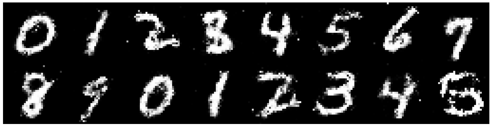

# Chatbot Assignment:

To complete this assignment, please use any LLM evaluation platform or tool you are familiar with — or simply try with [Poe](https://poe.com/) — to test different models, capture their responses, and document your findings.

* Compare at least 3 different models and provide insights on Content Quality, Contextual Understanding, Language Fluency and Ethical Considerations with examples.

Test Prompt: Multi-layered Business Analysis
Prompt: "A tech startup has 50% user churn in month 3, but their NPS score is 8.2/10. Their premium conversion rate is 2% while industry average is 5%. They just raised Series A funding but their burn rate increased 300%. The CEO wants to pivot to B2B. Analyze this situation, identify the core problems, and provide a strategic recommendation with implementation timeline."

Content Quality: Claude Sonnet 4's response demonstrates superior analytical depth with its "Fix Before Flight" strategic framework and clear phase-based implementation timeline. It provides specific, actionable recommendations with concrete metrics (e.g., "reduce burn rate by 40-50%," "target <20% month-3 churn"). DeepSeek offers a more practical, lean startup approach with its emphasis on rapid experimentation and validation, providing specific tactics like "10-20 target B2B customers" and concrete risk mitigation strategies. GPT-4's response (referenced) appears more comprehensive but potentially less focused in its recommendations.
Contextual Understanding: All three models correctly identified the core paradox between high NPS (8.2/10) and high churn (50%), but they interpret it differently. Claude frames this as an execution problem rather than product-market fit, while DeepSeek suggests the NPS might be skewed by a vocal minority. This shows varying levels of business acumen in interpreting contradictory metrics. Claude demonstrates deeper strategic thinking by questioning the pivot motivation as a "grass is greener" reaction, while DeepSeek takes a more pragmatic validation-first approach.
Language Fluency: Claude uses sophisticated business terminology and maintains consistent strategic framing throughout ("Fix Before Flight," "retention-first recovery"). DeepSeek employs more direct, tactical language with clear action items and timeline structures. Both maintain professional tone, but Claude's language feels more executive-level while DeepSeek's is more operator-focused. The structured presentation differs significantly - Claude uses narrative flow while DeepSeek uses bullet points and tables for clarity.
Ethical Considerations: All models responsibly avoid recommending layoffs directly but acknowledge the need for "cost optimization" and "strategic headcount optimization." They appropriately emphasize data-driven decision making and user research rather than assumptions. None suggest manipulative retention tactics, instead focusing on genuine value delivery improvements. The recommendations prioritize sustainable business practices over short-term growth hacking.

* What are the parameters that can be used to control response. Explain in detail.
The responses can be controlled through several key parameters that significantly impact output quality and style. Temperature settings directly influence creativity versus consistency - lower temperatures (0.1-0.3) produce more focused, analytical responses like Claude's structured framework, while higher temperatures (0.7-0.9) might generate more creative strategic alternatives. Token limits constrain response length, forcing models to prioritize key insights. DeepSeek's more concise format suggests tighter constraints. Prompt engineering techniques like specifying output format, directly shape the response structure. Context window utilization affects how much background information the model can process simultaneously. System prompts can preset analytical frameworks, explaining why Claude adopts a more strategic consulting tone while DeepSeek takes an operational approach. Sampling parameters like top-p and top-k control vocabulary diversity, affecting whether models use technical jargon or plain language. Role specification in prompts can dramatically alter perspective, specifying "you are a seasoned venture capitalist" versus "you are a startup founder" would yield different risk assessments and priorities.
* Explore various techniques used in prompt engineering, such as template-based prompts, rule-based prompts, and machine learning-based prompts and provide what are the challenges and considerations in designing effective prompts with examples.

The startup analysis case demonstrates several prompt engineering approaches with distinct advantages and limitations. Template-based prompts structure the request with specific sections. This approach ensures comprehensive coverage but may constrain creative problem-solving, as seen in how all models follow similar analytical frameworks. Rule-based prompts embed specific constraints like "provide implementation timeline" and "identify metrics to monitor," which successfully generated concrete deliverables from all models but potentially limited exploration of alternative strategic frameworks. Machine learning-based prompts would adapt based on previous successful business analysis patterns, though this isn't directly visible in the responses.
Key challenges include the specificity-creativity trade-off, highly structured prompts ensure complete coverage but may miss innovative solutions, while open-ended prompts risk incomplete analysis. Context sensitivity proves crucial, as the models needed to balance multiple contradictory signals (high NPS vs. high churn), requiring prompts that encourage nuanced interpretation rather than surface-level analysis. Domain expertise requirements become apparent in how different models interpreted business metrics - effective prompts must embed sufficient context for non-expert models while avoiding overwhelming expert-level models. Bias mitigation remains challenging, as prompts requesting "strategic recommendations" may implicitly favor growth-oriented solutions over sustainable or ethical alternatives. The most effective approach appears to combine structured analytical requirements with open-ended strategic thinking spaces, allowing models to demonstrate both systematic analysis and creative problem-solving within business constraints.

* What is retrieval-augmented generation(RAG) and how is it applied in natural language generation tasks?
Retrieval-Augmented Generation (RAG) is a method that enhances natural language generation (NLG) by combining a retrieval model with a generative model. Instead of relying solely on the generative model's internal knowledge, RAG retrieves relevant information from an external knowledge base to ground the output in factual content. First, a retriever identifies documents or passages related to the user’s query. Then, the generative model uses both the query and the retrieved information to produce a coherent, accurate response. This approach is widely used in tasks like question answering, customer support, document summarization, and personalized recommendations, as it reduces inaccuracies and improves relevance. By grounding responses in external data, RAG ensures more factual outputs, though it requires robust retrieval mechanisms and up-to-date knowledge sources for optimal performance.

<br>

<div align="center">

# Pantheon Lab Programming Assignment

<a href="https://pytorch.org/get-started/locally/"></a>
<a href="https://pytorchlightning.ai/"></a>
<a href="https://hydra.cc/"></a>
<a href="https://github.com/ashleve/lightning-hydra-template"></a><br>

</div>

## What is all this?
This "programming assignment" is really just a way to get you used to
some of the tools we use every day at Pantheon to help with our research.

There are 4 fundamental areas that this small task will have you cover:

1. Getting familiar with training models using [pytorch-lightning](https://pytorch-lightning.readthedocs.io/en/latest/starter/new-project.html)

2. Using the [Hydra](https://hydra.cc/) framework

3. Logging and reporting your experiments on [weights and biases](https://wandb.ai/site)

4. Showing some basic machine learning knowledge

## What's the task?
The actual machine learning task you'll be doing is fairly simple! 
You will be using a very simple GAN to generate fake
[MNIST](https://pytorch.org/vision/stable/datasets.html#mnist) images.

We don't excpect you to have access to any GPU's. As mentioned earlier this is just a task
to get you familiar with the tools listed above, but don't hesitate to improve the model
as much as you can!

## What you need to do

To understand how this framework works have a look at `src/train.py`. 
Hydra first tries to initialise various pytorch lightning components: 
the trainer, model, datamodule, callbacks and the logger.

To make the model train you will need to do a few things:

- [ ] Complete the model yaml config (`model/mnist_gan_model.yaml`)
- [ ] Complete the implementation of the model's `step` method
- [ ] Implement logging functionality to view loss curves 
and predicted samples during training, using the pytorch lightning
callback method `on_epoch_end` (use [wandb](https://wandb.ai/site)!) 
- [ ] Answer some questions about the code (see the bottom of this README)

**All implementation tasks in the code are marked with** `TODO`

Don't feel limited to these tasks above! Feel free to improve on various parts of the model

For example, training the model for around 20 epochs will give you results like this:



## Getting started
After cloning this repo, install dependencies
```yaml
# [OPTIONAL] create conda environment
conda create --name pantheon-py38 python=3.8
conda activate pantheon-py38

# install requirements
pip install -r requirements.txt
```

Train model with experiment configuration
```yaml
# default
python run.py experiment=train_mnist_gan.yaml

# train on CPU
python run.py experiment=train_mnist_gan.yaml trainer.gpus=0

# train on GPU
python run.py experiment=train_mnist_gan.yaml trainer.gpus=1
```

You can override any parameter from command line like this
```yaml
python run.py experiment=train_mnist_gan.yaml trainer.max_epochs=20 datamodule.batch_size=32
```

The current state of the code will fail at
`src/models/mnist_gan_model.py, line 29, in configure_optimizers`
This is because the generator and discriminator are currently assigned `null`
in `model/mnist_gan_model.yaml`. This is your first task in the "What you need to do" 
section.

## Open-Ended tasks (Bonus for junior candidates, expected for senior candidates)

Staying within the given Hydra - Pytorch-lightning - Wandb framework, show off your skills and creativity by extending the existing model, or even setting up a new one with completely different training goals/strategy. Here are a few potential ideas:

- **Implement your own networks**: you are free to choose what you deem most appropriate, but we recommend using CNN and their variants if you are keeping the image-based GANs as the model to train
- **Use a more complex dataset**: ideally introducing color, and higher resolution
- **Introduce new losses, or different training regimens**
- **Add more plugins/dependecy**: on top of the provided framework
- **Train a completely different model**: this may be especially relevant to you if your existing expertise is not centered in image-based GANs. You may want to re-create a toy sample related to your past research. Do remember to still use the provided framework.

## Questions

Try to prepare some short answers to the following questions below for discussion in the interview.

* What is the role of the discriminator in a GAN model? Use this project's discriminator as an example.

* The generator network in this code base takes two arguments: `noise` and `labels`.
What are these inputs and how could they be used at inference time to generate an image of the number 5?

* What steps are needed to deploy a model into production?

* If you wanted to train with multiple GPUs, 
what can you do in pytorch lightning to make sure data is allocated to the correct GPU? 

## Submission

- Using git, keep the existing git history and add your code contribution on top of it. Follow git best practices as you see fit. We appreciate readability in the commits
- Add a section at the top of this README, containing your answers to the questions, as well as the output `wandb` graphs and images resulting from your training run. You are also invited to talk about difficulties you encountered and how you overcame them
- Link to your git repository in your email reply and share it with us/make it public

